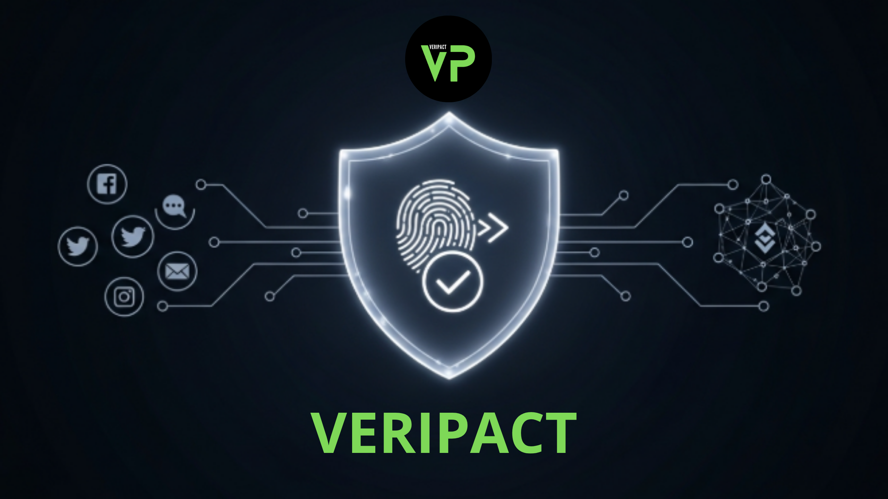

# Veripact

> An AI-powered protocol that generates a universal, on-chain 'Trust Profile' to secure P2P commerce.

 
---

## 🎯 The Problem

The P2P economy (freelancers, social commerce, digital asset sales) is a multi-trillion dollar market built on a foundation of zero trust. Every transaction with a stranger is a gamble. This creates two massive problems:

1.  **Financial Risk:** Scams are rampant, causing millions in losses and preventing countless valuable transactions from ever happening.
2.  **Reputation Silos:** A person's hard-earned 5-star reputation on one platform like Upwork is worthless on another like Discord. Reputation is not portable.

## ✨ Our Solution: The Veripact Protocol

Veripact is not another marketplace. It is a **portable trust and settlement layer** that makes P2P commerce safe and efficient on the platforms people already use.

Our core innovation is the **"Reputation Booster."** It's a tool that allows any user to build their on-chain trust profile from day one by verifying their past successful transactions. The process involves:

1.  **AI-Powered Evidence Analysis:** A user submits proof (invoices, receipts). Our AI Agent, using a multimodal model like **Google's Gemini**, acts as a forensic analyst to verify consistency and extract a unique transaction hash to prevent fraud.
2.  **Counterparty Confirmation:** The final validation comes from a gasless, cryptographic signature from the other person involved in the transaction.
3.  **On-Chain Record:** The verified transaction is then recorded in our `VeripactReputation.sol` smart contract, building a user's permanent and public trust profile.

## 🚀 Hackathon MVP Scope

This repository contains the MVP for the **Pond Founder Speedrun Hackathon**. Our goal is to build a functional proof-of-concept of the "Reputation Booster" feature.

The submission will include:
- A live web application for user onboarding and verification requests.
- A functional backend agent integrated with the AI API.
- The `VeripactReputation.sol` smart contract deployed on the Sepolia testnet.

## 🛠️ Tech Stack

- **Frontend:** React (Vite)
- **User Onboarding:** Privy (Social Login & Invisible Wallets)
- **Backend:** Node.js (Vercel Serverless Functions)
- **AI Model:** Google Gemini 1.5
- **Database:** Supabase
- **Smart Contract:** Solidity, Hardhat, OpenZeppelin Upgrades

## 🏁 Getting Started

*(Instructions on how to run the project locally will be added here soon.)*